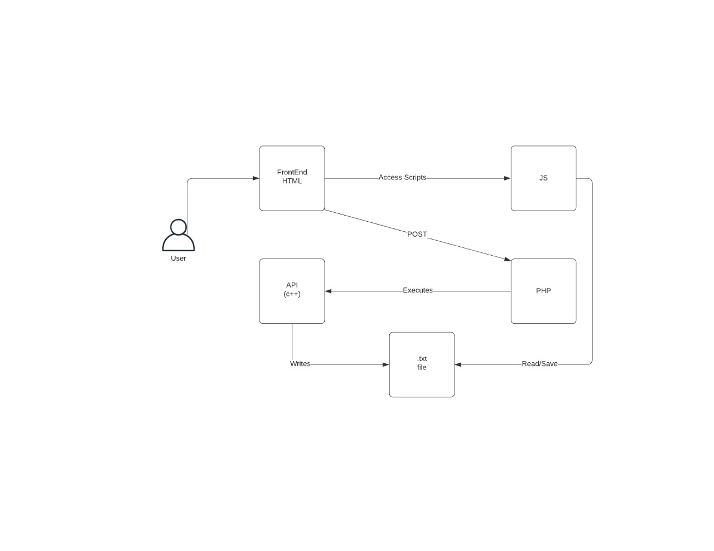

# *DISTRIBUCIÓN DE TRABAJOS EN UNA RED DE NODOS DISTRIBUIDOS*
---
#### Materia: *Análisis y diseño de algoritmos*

##### Integrantes:
1. *Francisco Acuña Franco* - *A01027294* - *CSF*
2. *Isaac Garza Strimlingas* - *A01025798* - *CSF*
3. *Sebastián Gómez Gutiérrez* - *A01374843* - *CSF*
4. *Sergio Hernández Castillo* - *A01025210* - *CSF*
5. *Rodrigo Sibaja Villarreal* - *A01023121* - *CSF*

---
## 1. Aspectos generales

Las orientaciones de la tarea se encuentran disponibles en la plataforma **Canvas**.

Este documento es una guía sobre qué información debe entregar como parte del proyecto, qué requerimientos técnicos debe cumplir y la estructura que debe seguir para organizar su entrega.

### 1.1 Requerimientos técnicos

A continuación se mencionan los requerimientos técnicos mínimos del proyecto, favor de tenerlos presente para que cumpla con todos.

* El equipo tiene la libertad de elegir las tecnologías de desarrollo a utilizar en el proyecto, sin embargo, debe tener presente que la solución final se deberá ejecutar en una de las siguientes plataformas en la nube: Google Cloud Platform(https://cloud.google.com/?hl=es), Amazon Web Services(https://aws.amazon.com/) o Microsoft Azure(https://azure.microsoft.com/es-mx/).
* El proyecto deberá utilizar una interfaz Web.
* La arquitectura deberá estar separada claramente por capas (*frontend*, *backend*, *API RESTful*, datos y almacenamiento) según se necesite.
* Todo el código, *datasets* y la documentación del proyecto debe alojarse en este repositorio de GitHub. Favor de mantener la estructura de carpetas propuesta.

### 1.2 Estructura del repositorio

El proyecto debe seguir la siguiente estructura de carpetas, la cual generamos por usted:
```
- / 			        # Raíz de todo el proyecto
    - README.md			# Archivo con los datos del proyecto (este archivo)
    - frontend			# Carpeta con la solución del frontend (Web app)
    - backend			  # Carpeta con la solución del backend (CMS)
    - api			      # Carpeta con la solución de la API
    - datasets		  # Carpeta con los datasets y recursos utilizados (csv, json, audio, videos, entre otros)
    - dbs			      # Carpeta con los modelos, catálogos y scripts necesarios para generar las bases de datos
    - docs			    # Carpeta con la documentación del proyecto
```

### 1.3 Documentación  del proyecto

Como parte de la entrega final del proyecto, se debe incluir la siguiente información:

* Descripción del problema a resolver.
* Diagrama con la arquitectura de la solución.
* Descripción de cada uno de los componentes de la solución.
* Guía de configuración, instalación y despliegue de la solución en la plataforma en la nube seleccionada.
* Documentación de la API. Puede ver un ejemplo en Swagger(https://swagger.io/). 
* El código debe estar documentado siguiendo los estándares definidos para el lenguaje de programación seleccionado.

## 2. Descripción del proyecto

En el siguiente proyecto, se simula una distribución de trabajo en una red de nodos distribuidos y en el caso específico de nuestro proyecto, se basa esta red en un sistema multiprocesador/multinúcleos en el que los trabajos que se estaran resolviendo serán matrices de NxM. Para cada sección del problema, se le pueden modificar diferentes parámetros para calcular las probabilidades y tiempos que ocurren ciertos eventos que se explicarán mas adelante. En la primera sección del sistema, se encuentra el generador de trabajos (matrices), en el cuál se crearan en un tiempo determinado por una distribución de Poisson dado por el parámetro 'x'; en este mismo, si una matriz no tiene otra con la cual se puede multiplicar, esta misma se pone en espera. En el momento en el que existe una matriz que pueda multiplicar una de esas matrices que se encuentran en espera, se redirige el trabajo hacia un procesador disponible (el tiempo en el que tarda en salir esta determinado por el parámetro 'delta'). En el sistema, pueden ocurrir dos tipos de fallos: RC (recuperación) y RB (rearranque).*

RC tiene una probabilidad de fallar, determinado por el parámetro 'C' y su recuperación le toma un tiempo determinado por el parametro 'Beta', el cuál estara dividido por uno. En el momento que acabe de recuperarse, el trabajo se recicla.

RB tiene una probabilidad de fallar, determinado por el parámetro 'C', el cual estara restado por 1 (1 - C) y su reinicio le toma un tiempo determinado por el parametro 'Alfa', el cuál estara dividido por uno. Es importante mencionar que ambos fallos, se multiplicaran por el numero de orden del procesador. En el momento en el que el sistema esta funcionando, es cuándo no existan fallos. Al final, los resultados estaran dados por el tiempo en que el usuario haya indicado y encontrara así la cantidad de trabajos reciclado y terminados y matrices en espera.

## 3. Solución

A continuación aparecen descritos los diferentes elementos que forman parte de la solución del proyecto:*

*1) En el frontend, tenemos index.html con bootstrap, en el que existe un form para que el cliente, pueda determinar los parámetros diferentes. En el momento en el que se da submit, un script en php (backend) se ejecuta para poder mandar los parámetros al ejecutable de c++ (API), a través de un shell_exec(). En el momento que el API acaba, sobreescribe dos archivos encontrados en la carpeta del frontend (por motivos de seguridad de js), un dataset en formato CSV; el primero, estara los movimientos del sistema y en el segundo dataset, solo se incluirán los resultados finales. Por último, el script de PHP redirige hacia simulPlay.html (en donde se realiza la animación del sistema)

2) En el momento que se abre simulPlay.html, se ejecuta el script de js, en el cual realiza un parse al primer dataset, lo coloca en un array de strings, separado por cada tabla de datos en un determinado momento. A través de una librería, convertimos este array de strings, en un JSON, el cuál se utiliza para poder determinar que tipo de figuras y colores se deben de desplegar en el sistema.

3) Por último, en simulation.html, podremos ver desplegados nuestros resultados del sistema en el tiempo determinado. Estos datos son desplegados a partir de otro archivo en js llamado result, en el que realiza un parse al segundo dataset y a partir del array creado, realizamos un reemplazamiento a divs específicos. Al final de la página se encuentra un botón de Home, para así realizar nuevas simulaciones, el redireccionamiento esta por parte de un script en PHP

### 3.1 Arquitectura de la solución



El HTML obtiene datos ingresados por el usuario mediante el Javascript y se los manda al PHP para poder hacer un script y mandarlos a la API. API procesa los datos y los sobreescribe en archivos, que posteriormente Javascrispt los leera. JavaScript ejecuta la simulación y es mostrada en HTML para que el usuario pueda ver la simulación. Cuando el usuario pida ver los resultados el HTML mostrara la información.

### 3.2 Descripción de los componentes

En cuanto al componente de PHP, decidimos usarlo para así mantener una comunicación entre el c++ y el html de manera simple, ya que PHP puede executar comandos dentro de un shell. Los datasets se decidieron hacer en formato CSV, para así tener una conversión rápida a JSON (esto lo realizamos de esta manera ya que, en c++ no pudimos realizarlo de manera directa en un archivo JSON). 

En cuanto a Javascript, decidimos usar sus componentes artísticos, para así poder realizar una animación que pudiese explicar lo que sucede en c++.

Utilizamos Google Cloud VM para así desplegar nuestra página en la nube.

### 3.3 Frontend

El front ende esta conformado por HTML, JavaScript y PHP. El HTML y CSS son los encargados de el diseño y lo que se muestra en la página web. El JavaScript tiene la función de agregar y eliminar tags del HTML segun lo indica la simulación. JS tambien se encarga de hacer la simulación con la información y parametros que recibe. El PHP es el que se encarga de enviar y recibir los los parametros para que el programa funcione. Mediante el PHP el usuario puede pasar de una pagina a otra.

#### 3.3.1 Lenguaje de programación
- HTML
- CSS
- JavaScript
- PHP
#### 3.3.2 Framework
#### 3.3.3 Librerías de funciones o dependencias
- jQuery
- Bootstrap
- Font Awesome
- Ionicons
- Owl Carousel

### 3.4 Backend

El backend esta conformado por el C++ y el PHP. El primero, es el que se encarga de recibir los parámetros enviados por el usuario, procesarlo y mandar una respuesta a través de archivos txt en formato csv.

Antes de avanzar, se debe aclarar 

El PHP, es el que se encarga de ejecutar el C++ y enviar estos mismos parámetros y recibir una respuesta de que el mismo programa termino, al mismo tiempo, se encarga de manejar los request's de usuarios para poder cambiar de página.

Para poder desplegar nuestra página, aprovechamos la funcionalidad de PHP para poder simular un servidor local a través de Debian (el cuál lo provee Google Cloud) y así evitar problemas con la ejecución del C++.

#### 3.4.1 Lenguaje de programación

- PHP
- C++

#### 3.4.2 Framework

- Debian

#### 3.4.3 Librerías de funciones o dependencias

- STD Library
- OpenMP
- Pthread

## 3.5 Pasos a seguir para utilizar el proyecto

1) Abrir Google Cloud y crear una máquina virtual en Linux con mínimo 4 cores

2) Bajar dependencias para compilar y usar diferentes lenguajes de programación (PHP y GCC)

3) Poner en la máquina virtual:
```php
php -S "ip interna":"puerto a preferencia"
```

4) Poner en el url "ip externa":"puerto a preferencia"

*NOTA: por seguridad, G-cloud no deja usar la ip externa, por lo que en la sección de redes se debe de crear una preferencia para acceder al localhost de la máquina virtual*

## 4. Referencias

https://developer.mozilla.org/en-US/docs/Web/JavaScript/Reference
https://www.w3schools.com/
https://www.php.net/
